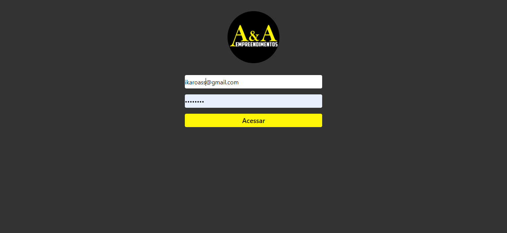
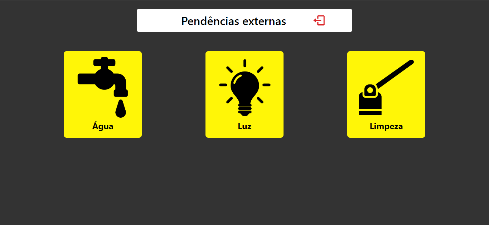
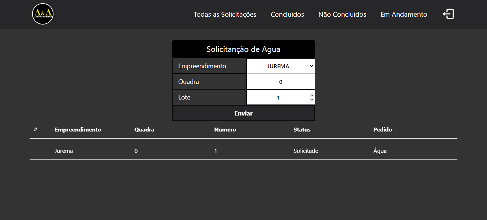
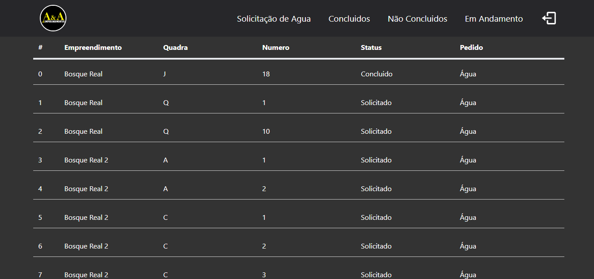

  
  <h1 align="center">19 - Pendencias Externas Part#1</h1>

 
# Sobre o projeto

## O projeto foi dividido em duas partes, a parte o web e mobile, Essa é a parte Web

### O projeto começa com a tela de login, onde só pessoas autorizadas irão ter acesso, logo tem a parte de solicitações, onde são elas Água, Energia e Limpeza, quando o cliente for fazer uma solicitação, ira ser informado o empreendimetno o lote e a quadra. as informações da solicitação será enviado ao banco de dados no Firebase, e na navegação do site sitem uma ideia de quantas solicitações foram feitas e concluidas

## Layout 

# Tecnologias utilizadas
- React.js
- TailwinCss
- Vite.js
- FireBase

# Autor

## @Hawk_web

<!-- linkedin -->

